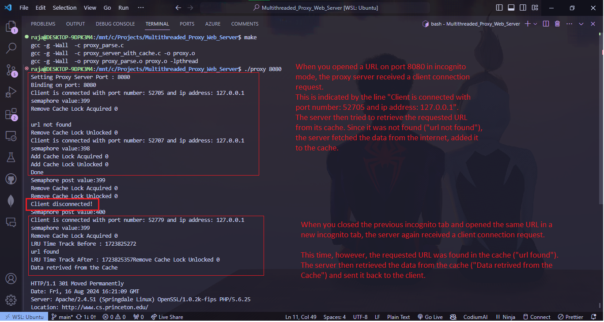

<h1>Multi Threaded Proxy Server with Cache</h1>

This project is implemented using `C` and Parsing of HTTP referred from <a href = "https://github.com/vaibhavnaagar/proxy-server"> Proxy Server </a>


## Index

- [Project Theory](https://github.com/Rpandey010/Multithreaded-Proxy-Web-Server#project-theory)
- [How to Run](https://github.com/Rpandey010/Multithreaded-Proxy-Web-Server#How-to-Run)
- [Demo](https://github.com/Rpandey010/Multithreaded-Proxy-Web-Server#Demo)


## Project Theory

[[Back to top]](https://github.com/Rpandey010/Multithreaded-Proxy-Web-Server#index)

##### Introduction

##### Basic Working Flow of the Proxy Server:


##### How did I implement Multi-threading?
- Used Semaphore instead of Condition Variables and pthread_join() and pthread_exit() function. 
- pthread_join() requires us to pass the thread id of the the thread to wait for. 
- Semaphore’s sem_wait() and sem_post() doesn’t need any parameter. So it is a better option. 


##### Motivation/Need of Project
- To Understand → 
  - The working of requests from our local computer to the server.
  - The handling of multiple client requests from various clients.
  - Locking procedure for concurrency.
  - The concept of cache and its different functions that might be used by browsers.
- Proxy Server do → 
  - It speeds up the process and reduces the traffic on the server side.
 
##### OS Component Used ​
- Threading
- Locks 
- Semaphore
- Cache (LRU algorithm is used in it)

##### Limitations ​
- Fixed size of cache element, so big websites may not be stored in cache. 

##### How this project can be extended? ​
- This code can be implemented using multiprocessing that can speed up the process with parallelism.
- We can implement requests like POST with this code.


## How to Run

```bash
$ git clone https://github.com/Rpandey010/Multithreaded-Proxy-Web-Server.git
$ cd MultiThreaded-Proxy-Web-Server
$ make all
$ ./proxy <port no.>
```
`Open http://localhost:port/https://www.cs.princeton.edu/`

# Note:
- This code can only be run in Linux Machine. Please disable your browser cache or use incognito

## Demo

#### The server then tried to retrieve the requested URL from its cache. Since it was not found ("url not found"), the server fetched the data from the internet, added it to the cache

#### Data retrived from the Cache


- When website is opened for the first time (`url not found`) then cache will be miss.
- Then if you again open that website again then `Data is retrieved from the cache` will be printed.

